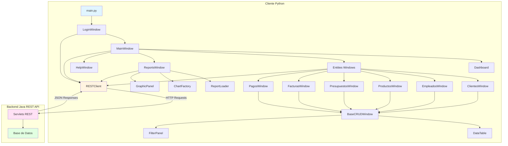
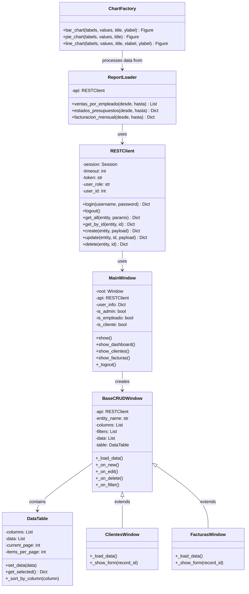
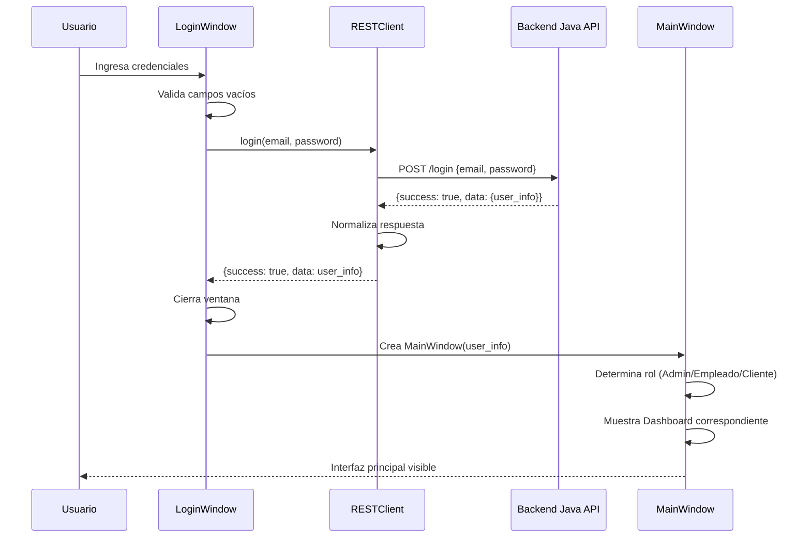
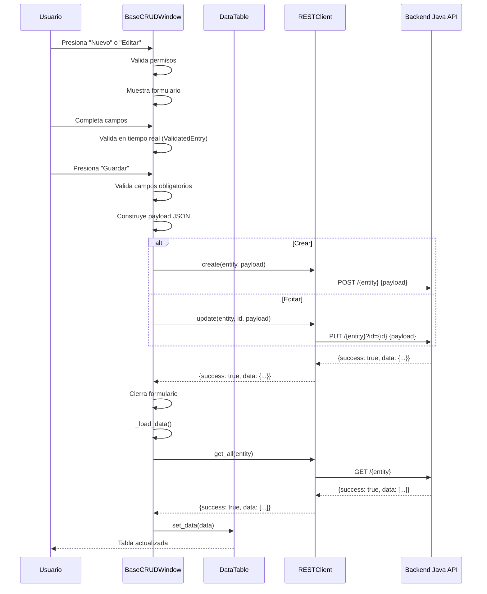
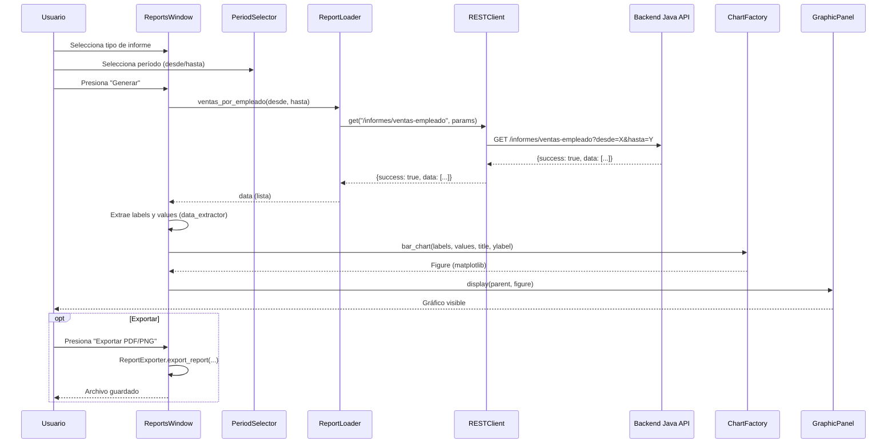
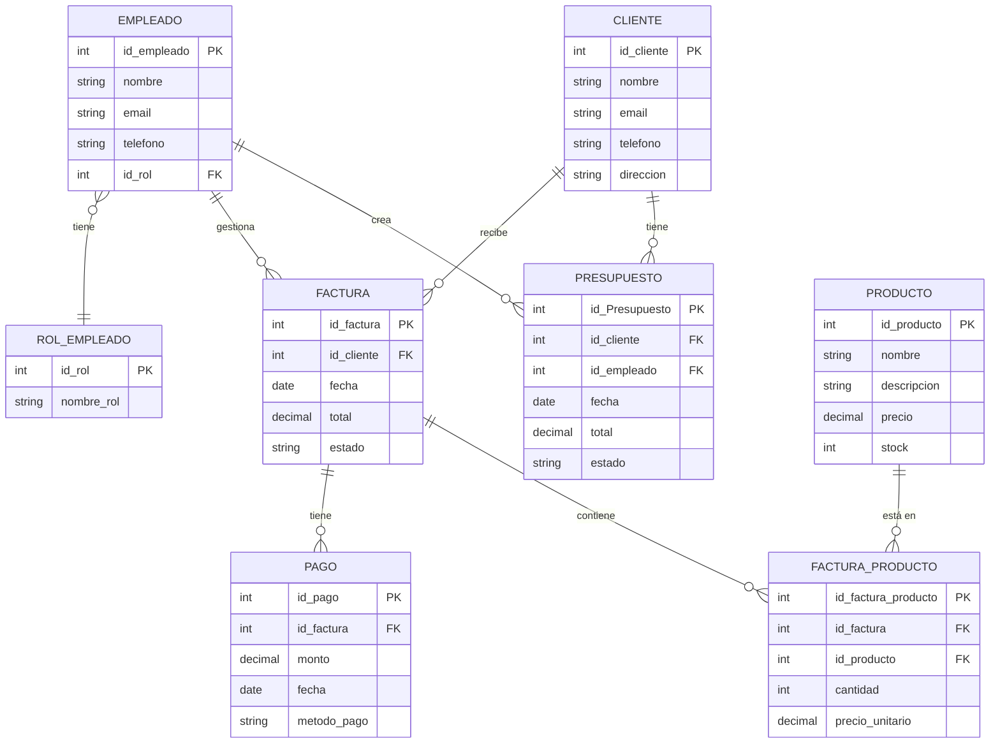
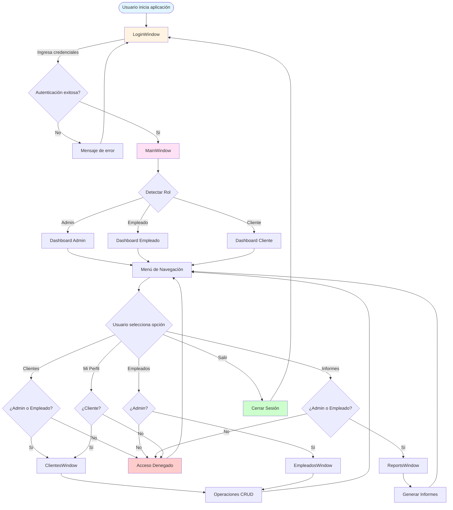
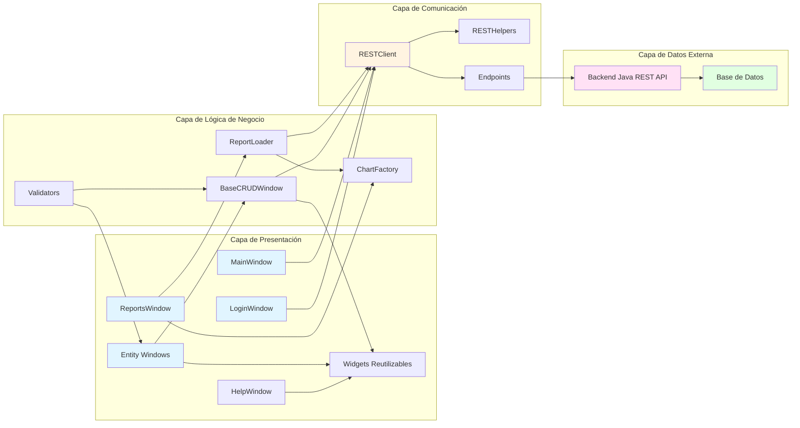
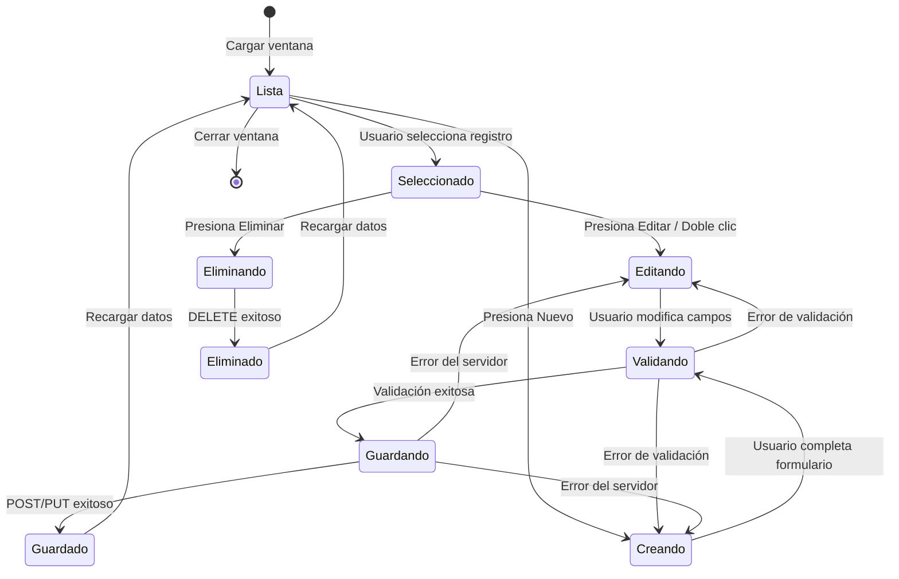
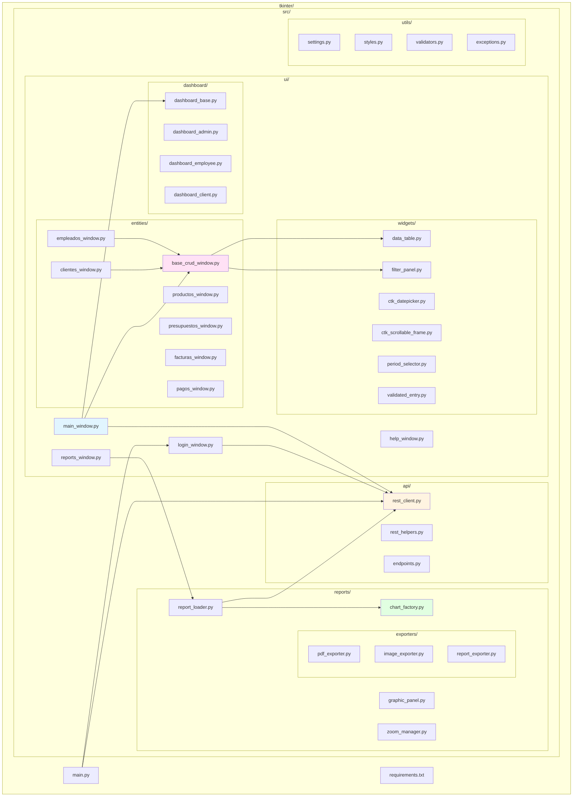

# Diagramas del Sistema - CRM XTART Cliente de Escritorio

Este documento contiene diagramas UML, ER y de flujo que representan la arquitectura y funcionamiento del cliente de escritorio Python.

## Extensiones recomendadas

### **Markdown Preview Mermaid Support**
Permite que VS Code renderice diagramas Mermaid dentro de archivos Markdown.

### **Mermaid Markdown Syntax Highlighting**
Añade sintaxis coloreada y reconocimiento de bloques Mermaid.

---

## Cómo instalarlas

1. Abrir **VS Code**.  
2. Pulsar **Ctrl + Shift + X** para abrir el panel de extensiones.  
3. Buscar cada extensión por su nombre exacto.  
4. Pulsar **Install**.  

Tras instalarlas, VS Code será capaz de renderizar los diagramas Mermaid integrados en el proyecto.

---

## Visualizar Diagramas Mermaid en VS Code

### **Visualizar un archivo Markdown (.md)**

1. Abrir el archivo que contiene los diagramas.  
2. Pulsar:  
   **Ctrl + Shift + V** → *Abrir vista previa Markdown*.  
3. Los diagramas Mermaid se renderizan automáticamente en la vista previa.

---

## Visualizar Diagramas Mermaid desde archivos `.mmd`

Si los diagramas están separados en archivos Mermaid independientes:

1. Instalar también la extensión **“Mermaid Preview”** (opcional pero recomendada).  
2. Abrir cualquier archivo `.mmd`.  
3. Pulsar **Ctrl + Shift + P**.  
4. Escribir: **Mermaid: Preview Mermaid Diagram**.  
5. VS Code abrirá una vista previa interactiva del diagrama.


---

## 1. Diagrama de Arquitectura General



---

## 2. Diagrama de Clases UML - Componentes Principales



---

## 3. Diagrama de Secuencia - Flujo de Login



---

## 4. Diagrama de Secuencia - Operación CRUD (Crear/Editar)



---

## 5. Diagrama de Secuencia - Generación de Informes



---

## 6. Diagrama Entidad-Relación (Entidades del Sistema)



---

## 7. Diagrama de Flujo - Navegación y Permisos



---

## 8. Diagrama de Componentes - Arquitectura del Sistema



---

## 9. Diagrama de Estados - Ciclo de Vida de una Entidad



---

## 10. Diagrama de Flujo - Proceso de Filtrado

```mermaid
flowchart TD
    Start([Usuario en ventana CRUD]) --> ShowFilters[Mostrar FilterPanel]
    ShowFilters --> Input[Usuario ingresa criterios]
    Input --> Apply{Presiona Aplicar Filtros?}
    
    Apply -->|No| Clear{Presiona Limpiar?}
    Clear -->|Sí| ClearFields[Limpiar campos]
    ClearFields --> LoadAll[Cargar todos los datos]
    Clear -->|No| Input
    
    Apply -->|Sí| BuildParams[Construir parámetros de consulta]
    BuildParams --> Request[GET /{entidad}?param1=value1&param2=value2]
    Request --> Backend{Backend responde}
    
    Backend -->|Éxito| ProcessData[Procesar datos recibidos]
    Backend -->|Error| ShowError[Mostrar mensaje de error]
    ShowError --> Input
    
    ProcessData --> Normalize[Normalizar IDs y campos]
    Normalize --> FilterClient{¿Modo Cliente?}
    
    FilterClient -->|Sí| FilterByUser[Filtrar por user_id]
    FilterClient -->|No| UpdateTable
    
    FilterByUser --> UpdateTable[Actualizar DataTable]
    LoadAll --> UpdateTable
    UpdateTable --> Display[Mostrar resultados]
    Display --> Input
    
    style Start fill:#e1f5ff
    style Request fill:#fff4e1
    style Backend fill:#ffe1f5
    style Display fill:#e1ffe1
```

---

## 11. Diagrama de Paquetes - Estructura Modular



---

## Notas sobre los Diagramas

### Diagrama de Arquitectura General
Muestra la estructura general del sistema y cómo los componentes principales se relacionan entre sí y con el backend.

### Diagrama de Clases UML
Representa las clases principales del sistema, sus atributos y métodos clave, así como las relaciones de herencia y composición.

### Diagramas de Secuencia
Ilustran la interacción temporal entre objetos durante operaciones específicas como login, CRUD e informes.

### Diagrama ER
Muestra las entidades del dominio de negocio y sus relaciones, tal como las maneja el cliente (aunque la persistencia está en el backend).

### Diagramas de Flujo
Describen los procesos de negocio desde la perspectiva del usuario y el sistema.

### Diagrama de Estados
Muestra el ciclo de vida de una entidad durante las operaciones CRUD.

### Diagrama de Componentes
Representa la arquitectura en capas del sistema.

### Diagrama de Paquetes
Muestra la organización física del código en módulos y paquetes.

---

## Herramientas para Visualizar

Estos diagramas están escritos en **Mermaid**, que puede visualizarse en:
- GitHub (renderizado automático en archivos .md)
- GitLab
- VS Code (con extensión Mermaid)
- Documentación online (Mermaid Live Editor: https://mermaid.live)
- Herramientas de documentación como MkDocs, Docusaurus, etc.

Para exportar a otros formatos (PNG, SVG, PDF), puedes usar:
- Mermaid CLI: `npm install -g @mermaid-js/mermaid-cli`
- Herramientas online de conversión
- Extensiones de VS Code que permiten exportar

